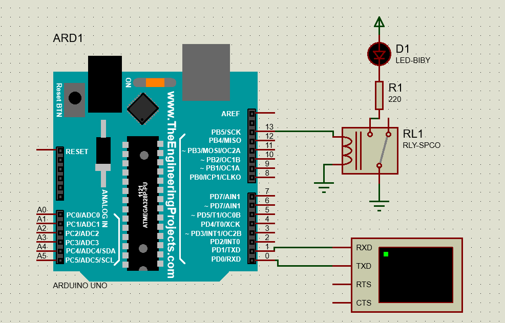

# Ulcrasonic
Set on/off for ultrasonic generator

<table align="center">
  <tr>
    <th>Product model</th>
    <th>Driving power</th>
    <th>Power control</th>
    <th>Working frequency</th>
    <th>Working voltage</th>
    <th>Maximum output current</th>
    <th>Ambient temperature</th>
  </tr>
  <tr>
    <td>JYD-1500E</td>
    <td>600-1200W</td>
    <td>0-100%</td>
    <td>40KHz/80 KHz/100 KHz</td>
    <td>220V/110V±10% 50Hz/60Hz</td>
    <td>4A</td>
    <td>0-40ºC</td>
  </tr>
</table>

 
 
 
 
 
 <a href="https://jydultrasonic.en.made-in-china.com/product/vOpaAsFxhQkz/China-Jyd-1500e-1200W-1500W-28-40-80-100-120kHz-MCU-Sweep-Multi-Frequency-Ultrasonic-Wave-Generator-for-Ultrasonic-Cleaning.html">Got to store</a>

